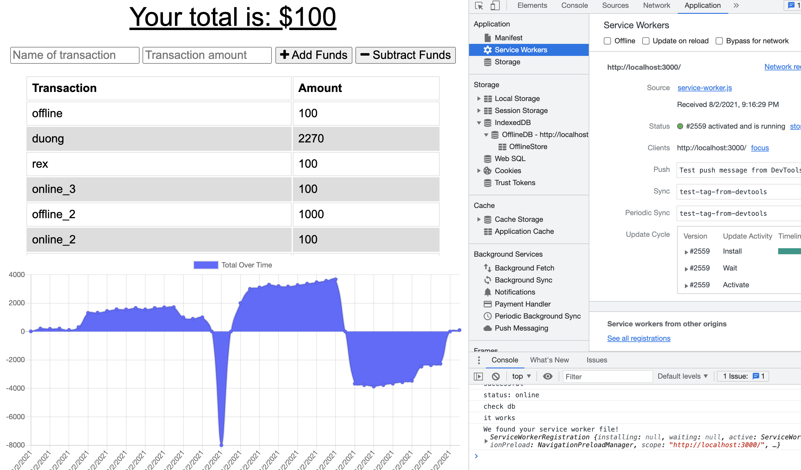

# Workout-Tracker

## Description
the application is to allow user to track the budget at any time regardless the internet connection. IndexedDB and catche work toegther to keep the UI operational while offline, and be able to update the backend as soon as the reconnection.
## Table of Contents
- [Installation](#installation)
- [Tests](#tests)
- [Usage](#usage)
- [Credits](#credits)
- [License](#license)
## Installation
For future developer,
1. npm i
2. run the server via npm run watch

### Tests
n/a

## Usage
Users can use mongodb to test out `post` and `get` methos

### click here to check out deployed app (https://blooming-waters-71639.herokuapp.com)

## Contributing
you may fork this application by the following steps
 1. **Fork** the repo on GitHub
 2. **Clone** the project to your own machine
 3. **Commit** changes to your own branch
 4. **Push** your work back up to your fork
 5. **Other Notes**

## Credits
1. rex 2. google

## License
* Licensed under the MIT license (MIT) License. Copyright © 2021
---
## Contacts
GitHub: [yu19910513](https://github.com/yu19910513/)

Email: [rexyu@uw.edu](mailto:rexyu@uw.edu)

## MIT License

Permission is hereby granted, free of charge, to any person obtaining a copy of this software and associated documentation files (the "Software"), to deal in the Software without restriction, including without limitation the rights to use, copy, modify, merge, publish, distribute, sublicense, and/or sell copies of the Software, and to permit persons to whom the Software is furnished to do so, subject to the following conditions:

The above copyright notice and this permission notice shall be included in all copies or substantial portions of the Software.

THE SOFTWARE IS PROVIDED "AS IS", WITHOUT WARRANTY OF ANY KIND, EXPRESS OR IMPLIED, INCLUDING BUT NOT LIMITED TO THE WARRANTIES OF MERCHANTABILITY, FITNESS FOR A PARTICULAR PURPOSE AND NONINFRINGEMENT. IN NO EVENT SHALL THE AUTHORS OR COPYRIGHT HOLDERS BE LIABLE FOR ANY CLAIM, DAMAGES OR OTHER LIABILITY, WHETHER IN AN ACTION OF CONTRACT, TORT OR OTHERWISE, ARISING FROM, OUT OF OR IN CONNECTION WITH THE SOFTWARE OR THE USE OR OTHER DEALINGS IN THE SOFTWARE.

